# .Net 6 WebAPI Service with OpenTelemetry Metrics Example

## Overview

OpenTelemetry is a collection of tools, APIs, and SDKs. Use it to instrument, generate, collect, and export telemetry data (metrics, logs, and traces) to help you analyze your software's performance and behavior.

If you are not familiar with the OpenTelemetry project, I strongly recommend you thoroughly read the official documentation on the <https://opentelemetry.io/> to get a deep understanding of underlain concepts.

This repository is focused on metrics only. It gives you a quick introduction in metrics concepts, if you are not familiar with, and a practical step-by-step guide how to use metrics in your projects as well as how to gather, store, query and visualize them with Prometheus. Also, it shows you how to simply add monitoring of your host with Node Exporter, if your are already using Prometheus. The repository contains a source code of a .Net 6 service instrumented with some useful metrics as well as a bunch of custom metrics. The service can be used as a starting point for your own services with the OpenTelemetry.

## Concepts

### Metrics

The OpenTelemetry defines three metric instruments:

- counter: a value that is summed over time – you can think of this like an odometer on a car; it only ever goes up.
- measure: a value that is aggregated over time. This is more akin to the trip odometer on a car, it represents a value over some defined range.
- observer: captures a current set of values at a particular point in time, like a fuel gauge in a vehicle.

Each of them is intended for specific goal and you should thoughtfully select them dependent of your purpose. For example, you can use counter to summarize the overall amount of bytes written on disk, observer to get memory consumption over time, or measure to get understanding of your REST API performance when you want to know a distribution of API requests' execution latency.

The current implementation for .Net gives you classes for each of metrics types - Counter, Histogram and ObservableGauge respectively.

### Metrics and Timeseries

Our metrics changes over time, so we can't store just a single value. We should store each metric values as a sequence of pairs consist of value and correspondent time. These sequences are named timeseries. When you add a new metric to your application you typically specify its name, unit of measurement, value type and attributes (a.k.a. dimensions). Each unique combination of these properties comprise a distinct timeseries. You can think about the timeseries as tables in a database. You should maintain a reasonable amount of timeseries and should not allow the amount ever grow (see below for details).

### Metrics Names and Attributes (or Labels)

When you start using metrics they tend to quickly grow in amount, so to make them more maintainable and understandable by others you should use naming conventions. A short list of useful conventions you can find on the page [Metric and Label Naming](https://prometheus.io/docs/practices/naming/) of Prometheus documentation. Carefully select names for your metrics.

To reduce number of metrics use attributes to differentiate them instead of distinct metrics. Attribute is a key-value pair, metric can have any number of attributes. For example, instead of create distinct metrics for each of a service endpoint (add_user_requests_total, get_users_requests_total and so on) you can use single metric "requests_total" with attribute "endpoint" with values "add_user",  "get_users" and so on. Moreover, you can add "verb" attribute with values "POST", "GET" and so on to get more detailed information. In other case should have to use a combination of metrics for each of the endpoints and verbs.

Remember, that each new attribute value yields a new time series. Metric can have more than one attribute and each new combination of attributes values will create a new timeseries. This means that you should use a limited amount of values for attributes. For example, you can use a metric "cpu_seconds" with "core"="1", "core"="2" attributes, but you should avoid using attribute, something like "temperature"="20.6", "temperature"="14.2" because temperature can have a huge amount of values. If you do so this explode Prometheus very quickly, because you create this way an ever growing amount of timeseries.

### Histograms

Histograms deserve a separate discussion. TBD
<https://prometheus.io/docs/practices/histograms/>

## Step-by-step Guide

### 1. Create a New Service and Configure OpenTelemetry

You can create a new service or use an existing one.

Add the necessary packages to your project:

```bash
dotnet add package OpenTelemetry --version 1.3.0
dotnet add package OpenTelemetry.Extensions.Hosting --version 1.0.0-rc9.4
dotnet add package OpenTelemetry.Exporter.Prometheus --version 1.3.0-rc.2
```

The first two packages is mandatory and contains core components.

The last added package is `OpenTelemetry.Exporter.Prometheus`. It's a so called `exporter`. Exporters are used to gather and pass all metrics to a backend to collect, store and query them. Typically, we want to use a time-series database as a backend. Of course, you can use a console exporter, but we will use `Prometheus` (see below) in this example as much more useful one. You can read more about exporters on [this](https://opentelemetry.io/docs/instrumentation/net/exporters/) page.

In your `Program.cs` add the following code to add all necessary services:

```csharp
// Add OpenTelemetry services
builder.Services.AddOpenTelemetryMetrics(builder =>
{
    builder
        .AddPrometheusExporter();
});
```

Then enable the Prometheus exporter:

```csharp
// Configure Prometheus exporter
app.UseOpenTelemetryPrometheusScrapingEndpoint();
```

It automatically adds a new endpoint `/metrics` which can be used to get metrics.
Build and start your service, open a browser and navigate to `http://localhost:5000/metrics` to see your service metrics. Note! The port can other than `5000`, so please, don't forget to use a right one.

Do you see anything? No, you don't. This is because we didn't add any metrics. Let's add some.

### 2. Add a Basic Telemetry

Add the following instrumentation package:

```bash
dotnet add package OpenTelemetry.Instrumentation.Runtime --version 1.0.0
```

And then configure metrics:

```csharp
// Add OpenTelemetry services
builder.Services.AddOpenTelemetryMetrics(builder =>
{
    builder
        .AddRuntimeInstrumentation()  // <---- Add this line
        .AddPrometheusExporter();
});
```

Start your service, wait a minute and navigate to `http://localhost:5000/metrics`. Now you see some metrics, automatically gathered for you by the instrumentation library. You'll see something like this:

```bash
# HELP process_runtime_dotnet_gc_allocations_size_bytes Count of bytes allocated on the managed GC heap since the process start. .NET objects are allocated from this heap. Object allocations from unmanaged languages such as C/C++ do not use this heap.
# TYPE process_runtime_dotnet_gc_allocations_size_bytes counter
process_runtime_dotnet_gc_allocations_size_bytes 10566480 1660737250055

# HELP process_runtime_dotnet_thread_pool_threads_count The number of thread pool threads that currently exist.
# TYPE process_runtime_dotnet_thread_pool_threads_count gauge
process_runtime_dotnet_thread_pool_threads_count 9 1660737250055

other metrics....
```

More information about DotNet Runtime instrumentation package your can find in this [GitHub repo](https://github.com/open-telemetry/opentelemetry-dotnet-contrib/tree/main/src/OpenTelemetry.Instrumentation.Runtime).

### 3. Install and Run Prometheus

We will use [Prometheus](https://prometheus.io/) to collect metrics which our service will produce and publish.

#### What is the Prometheus?

It's an open-source timeseries database with alerting and query language.

#### Why is the Prometheus?

Basically, the reasons are:

- Simple installation
- Very fast
- Low resource consumption
- Rich query language and integrated data visualization

The alternatives you can find on [this](https://prometheus.io/docs/introduction/comparison/) page.

#### Visualize Data With the Prometheus

Let's begin. [Download the latest release](https://prometheus.io/download). Follow the [instruction](https://prometheus.io/docs/introduction/first_steps/) to configure and run it. You can use the simplest possible configuration file as following:

```yaml
global:
  scrape_interval: 15s
  evaluation_interval: 15s

scrape_configs:
  - job_name: "Otel-web-api-service"
    static_configs:
      - targets: ["localhost:5000"]
```

Note the last line with the `localhost:5000` string. This is your service host and port.
Just place it next to Prometheus executable file and run it, then run your service and wait a couple of minutes.

Navigate to `http://localhost:9090` - this is the defaults for the Prometheus, and type `process_runtime_dotnet_gc_allocations_size_bytes` in the query field:

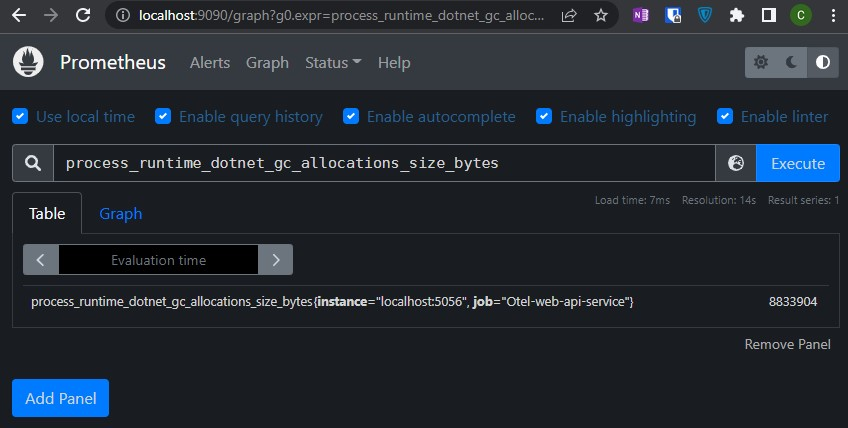

Select `Graph` tab:

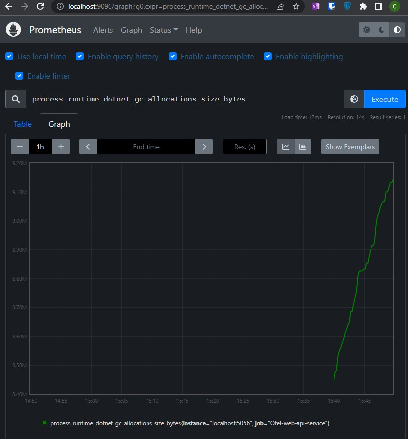

If you use a service example from this repo, you can play with `Memory/Allocate`, `Memory/Free` and `Memory/FreeAll` endpoints to allocate and free memory to see how it influences to the plot:

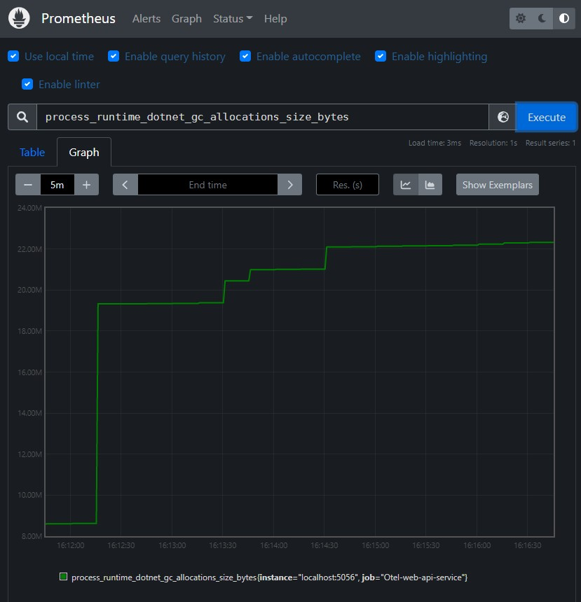

### Add a Custom Counter

I will use a sample service from this repository. To use a custom metric we need some steps:

- some stuff, which we want to measure;
- the counter itself;
- enable the counter;
- use the counter;
- visualize the data.

#### Stuff To Be Measured

To make the example more realistic, let's consider some worker. We can start the worker with a given name. The worker does its job and after some time automatically finishes. We can run multiple workers and they will work simultaneous.

The worker implementation is straightforward (see `Worker.cs`):

```csharp
    public class Worker
    {
        public Worker ()
        {
        }

        public async Task Run()
        {
            await Task.Run(async () =>
            {
                var sec = Random.Shared.Next(120);
                await Task.Delay(sec * 1000);
            });
        }
    }
```

We want to count the amount of active instances of workers as well as the amount of all created workers.

#### A Counter of Workers

We will use a class to gather all metrics together and will call it `Metrics` (see [Metrics.cs](https://github.com/drwatson1/Otel-sandbox/blob/master/src/otel-webapi-service/otel-webapi-service/Metrics.cs)).

First of all, we should create a `Meter` - something like a factory to create any metrics.

```csharp
public Meter Meter { get; } = new Meter("otel_webapi_service", "1.0");
```

Our meter contains a name and version. This name we will use later.
Next, we create counters:

```csharp
ActiveInstances = meter.CreateCounter<long>("otel_workers_active_instances_total", "items", "Number of active workers");
Count = meter.CreateCounter<long>("otel_workers_total", "items",  "Number of created workers");
```

Each counter should have a mandatory name and optional unit and description.

#### Enable our counters

Each counter is associated with its correspondent `Meter`. To make counters work you should add your meter first. Let's go back to our `Program.cs` and add our meter:

```csharp
// Add OpenTelemetry services
builder.Services.AddOpenTelemetryMetrics(builder =>
{
    builder
        .AddMeter("otel_webapi_service")    // <---- Add this line
        .AddRuntimeInstrumentation()  
        .AddPrometheusExporter();
});
```

Note the name of the added meter, it should be the same as used for your meter. You can add as many meters as you want. After the meter is added, all your counters will be enabled by default and you will be able disable or enable each of them.

#### Use a Counter

Using the counter is pretty simple. Let's return to our worker and add counters:

```csharp
public async Task Run()
{
    await Task.Run(async () =>
    {
        Metrics.Workers.ActiveInstances.Add(1, TagList);
        Metrics.Workers.Count.Add(1, TagList);

        var sec = Random.Shared.Next(120);
        await Task.Delay(sec * 1000);
    });
    Metrics.Workers.ActiveInstances.Add(-1, TagList);
}
```

As you can see, the counter allow you add or remove any value and attach tags to the counters. Tag is a simple key-value pair. We use only one tag with the name of the worker:

```csharp
TagList = new TagList
{
    new("name", name)
};
```

We use tags to group counters. For example, in our example we attach a worker name to each of the counter, which allow us to view an amount of active instances with the given name as well as all active instances. You can use more than one tag, if you need it.

#### Visualize the Data

Let's see, what we have now. Start the service and navigate to <http://localhost:5000/swagger>.

Find a `Workers/Run` endpoint, expand it and click on `Try it out` button. Enter the worker name `workerA` in the field below and click `Execute` some times. Than change the name to the `workerB` and click again two or more times. Each time, when you click `Execute`, a new worker starts.

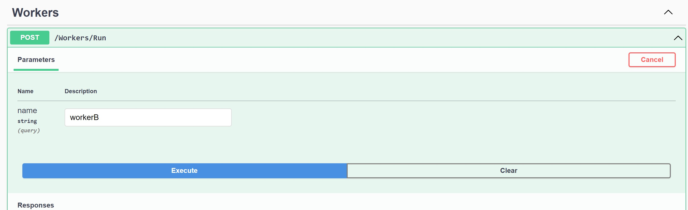

So, you have just started some workers named `workerA`, and some workers named `workerB`. After a while, each of them will be stopped. To see the dynamics of that process, open <http://localhost:9090> - the Prometheus console.

Type `otel_workers_active_instances_total` in the Expression field and press `Execute` button (note, that you should switch to the `Graph` tab before). If you use the names, as I suggested, `workerA` and `workerB`, you will see two plots with different colors:

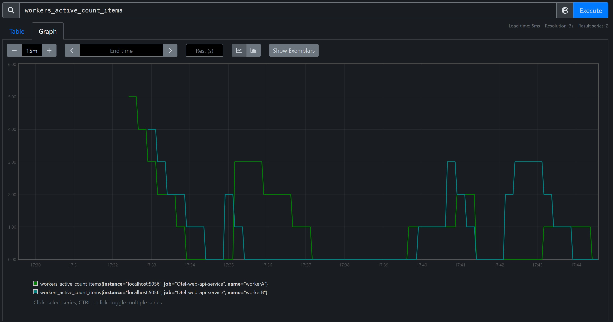

When you create a new worker the plot goes up, when a worker finishes its working the plot goes down.

Prometheus provides a PromQL language to query data. You can learn more on the [official pages](https://prometheus.io/docs/prometheus/latest/querying/basics/). Here we will use one of them. On the plots above we've seen two distinct graphs for each of the names `workerA` and `workerB`. To see the total amount of active workers type `sum(otel_workers_active_instances_total)` to the `Expression` field and click `Execute`:

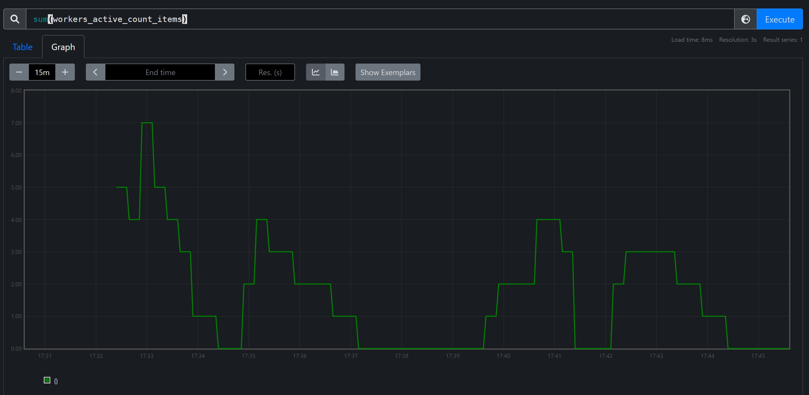

### Measure HTTP Requests Duration

As we are creating a WebAPI service, one of the most interesting metrics can be an average response time. But we can't use counter to measure duration. OpenTelemetry DotNet implements only one option to measure duration - metrics with type `Histogram`. Basically, the `Histogram` metrics consists of a number of buckets as well as a sum and count of measurements. Please, read more about it [here](https://prometheus.io/docs/practices/histograms/).

#### Instrument ASP.Net Core

First, let's add a new metrics to measure response time. We will use the [OpenTelemetry.Instrumentation.AspNetCore](https://github.com/open-telemetry/opentelemetry-dotnet/tree/main/src/OpenTelemetry.Instrumentation.AspNetCore) package. It adds a new `http_server_duration` metrics which measure duration of each HTTP-request as `Histogram` metrics.

Add [OpenTelemetry.Instrumentation.AspNetCore](https://github.com/open-telemetry/opentelemetry-dotnet/tree/main/src/OpenTelemetry.Instrumentation.AspNetCore) package to the project dependencies:

```bash
dotnet add package OpenTelemetry.Instrumentation.AspNetCore --version 1.0.0-rc9.4
```

Next, add corresponding services:

```csharp
builder.Services.AddOpenTelemetryMetrics(builder =>
{
    builder
        .AddMeter("otel_webapi_service")
        .AddAspNetCoreInstrumentation()  // <-- Add this line
        .AddRuntimeInstrumentation()
        .AddPrometheusExporter();
});
```

Than, let's create something that we will monitor. We create a new controller `JobController` (see [JobController.cs](https://github.com/drwatson1/Otel-sandbox/blob/master/src/otel-webapi-service/otel-webapi-service/Controllers/JobController.cs)) and two end points: `RunLongJob` and `RunVeryLongJob`. The first one runs random time from 0 to 500 ms, the second - from 600 to 1000 ms:

```csharp
[HttpGet("RunLongJob")]
public IActionResult RunLongJob()
{
    var delay = random.Next(500);
    Thread.Sleep(delay);
    return Ok($"The job takes {delay} msec");
}

[HttpGet("RunVeryLongJob")]
public IActionResult RunVeryLongJob()
{
    var delay = random.Next(600, 1000);
    Thread.Sleep(delay);
    return Ok($"The job takes {delay} msec");
}
```

As you can see we don't add a single line of code to measure duration because the [OpenTelemetry.Instrumentation.AspNetCore](https://github.com/open-telemetry/opentelemetry-dotnet/tree/main/src/OpenTelemetry.Instrumentation.AspNetCore) library measures it for us.

Ok, now we are ready to see what we got.

#### Query and Visualize Requests Duration

Build and run your service. Navigate to <http://localhost:5000/swagger> page and make run each of `Job`'s endpoint some times with 10 to 20 seconds between clicks to emulate a bunch of pretty long running queries. Open the <http://localhost:9090> page in a separate browser tab, type `http_server_duration_ms_bucket` in the `Expression` field and hit `Execute` button. You'll see something like the following:

```plaintext
http_server_duration_ms_bucket{http_flavor="HTTP/1.1", http_host="localhost:5000", http_method="GET", http_scheme="http", http_status_code="200", http_target="Job/RunLongJob", instance="localhost:5000", job="otel-webapi-service", le="+Inf"}
95
http_server_duration_ms_bucket{http_flavor="HTTP/1.1", http_host="localhost:5000", http_method="GET", http_scheme="http", http_status_code="200", http_target="Job/RunLongJob", instance="localhost:5000", job="otel-webapi-service", le="10"}
2
http_server_duration_ms_bucket{http_flavor="HTTP/1.1", http_host="localhost:5000", http_method="GET", http_scheme="http", http_status_code="200", http_target="Job/RunLongJob", instance="localhost:5000", job="otel-webapi-service", le="100"}
14
http_server_duration_ms_bucket{http_flavor="HTTP/1.1", http_host="localhost:5000", http_method="GET", http_scheme="http", http_status_code="200", http_target="Job/RunLongJob", instance="localhost:5000", job="otel-webapi-service", le="1000"}
95
```

Each line represents a singe timeseries for our `http_server_duration_ms` metric with attributes. The most interested attributes are `http_target` and `le`. The `http_target` is an endpoint which was requested. The `le` is an upper bound of a bucket. The value of the metrics is the amount of times when an HTTP requests duration fall into the corresponding bucket. By default, `http_server_duration_ms` metrics contains a bunch of pre-configured buckets, but you can change them, as we will see later (??? TBD).

You can use filters to query the most interesting values, for example, try the expression:

```plaintext
http_server_duration_ms_bucket{http_target="Job/RunLongJob"}
```

or

```plaintext
http_server_duration_ms_bucket{http_target="Job/RunVeryLongJob"}
```

to see buckets only for the specified endpoint. You can use any attribute or much more tricky expressions with operators and functions. Some of them we will use later.

Try `http_server_duration_ms_sum` or `http_server_duration_ms_count` to see what happens.

Note that these metrics are not a single value but a timeseries, ever increasing over time. We can see that on a graph. Click on `Graph` tab and type:

```plaintext
http_server_duration_ms_sum{http_target=~"Job.*"}
```

Click `Execute` to see the result:

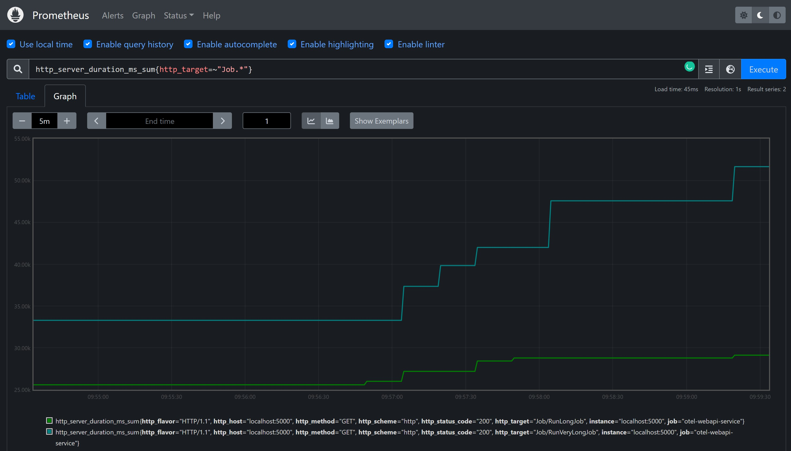

As you can see there are two plots for each of endpoints and all are increasing over time.

Sometimes we need an aggregated value by all endpoints and we can easily done this by using functions in an expression. In our case we can use `sum` function:

```plaintext
sum(http_server_duration_ms_sum{http_target=~"Job.*"})
```

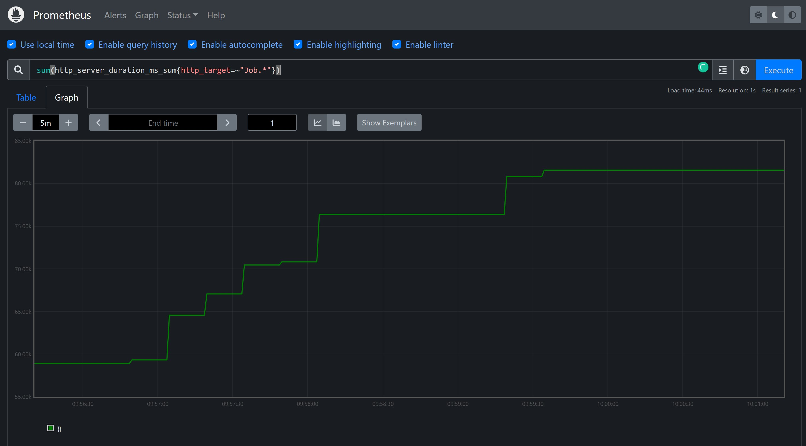

Great, now we know how all that stuff works but it's not very useful from practical point of view.

Usually we want to see an average server response time by endpoints, but averaging by all values over time is not that we want. Instead, we want values averaging by some sliding time-window. Let's see, how we can do it. Average duration is sum of all durations divided by count of queries.

Let's try this expression:

```plaintext
sum(rate(http_server_duration_ms_sum{http_target=~"Job.*"}[5m])) /
sum(rate(http_server_duration_ms_count{http_target=~"Job.*"}[5m]))
```

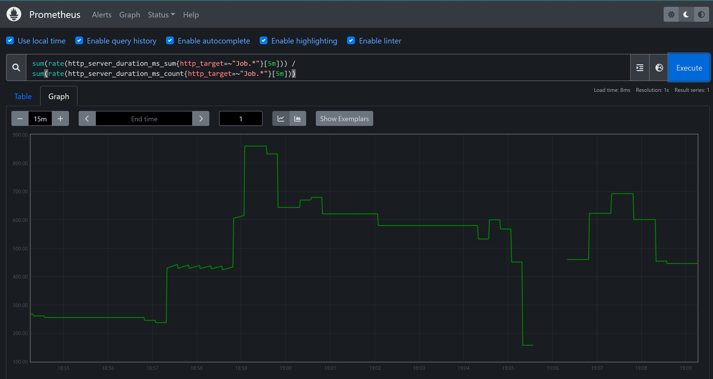

As earlier, we sum values by all our endpoints, but we can remove `sum` function to get distinct plots for each endpoint.

TDB Custom Histogram

## Monitoring Linux Host Metrics

Very often we need to monitor basic host parameters where your application works, such as CPU usage, memory consumptions or available disk free space. This is extremely easy to do with the Prometheus and Node Exporter. For more information see [step-by-step](https://prometheus.io/docs/guides/node-exporter/) guide.

### Install and Run Node Exporter

Download the [latest version](https://github.com/prometheus/node_exporter/releases/latest) of the Node Exporter for your OS. Unpack `node_exporter` file from the `tar.gz` archive, place it somewhere on the host which you will monitor and run it.

You can read more on its [GitHub page](https://github.com/prometheus/node_exporter/) about all configuration options but for our purposes it will be enough.

Go to the Prometheus folder on your local host and add a new job to gather statistics from Node Exporter:

```yaml
...skipped

scrape_configs:
  - job_name: otel-web-api-service
    static_configs:
      - targets: ["localhost:5000"]
  - job_name: node-exporter # <-- Add a new job
    static_configs:
      - targets: ["IP-address:9100"]
```

Of course, you should specify your monitored host's IP-address. By default, Node Exporter uses port 9100.

Restart the Prometheus. That's all!

Now, let's explore what we've got.

### Host metrics

All metrics, which Node Exporter exposes have `node_` prefix. The list of all metrics you'll find on [GitHub](https://github.com/prometheus/node_exporter#collectors).

Let's see the most interesting metrics.

#### CPU usage

In the `Expression` field type:

```plaintext
sum(rate(node_cpu_seconds_total{mode=~"system|user"}[1m])) by (cpu)
```

and click `Execute` button or just press `Enter`. Click on `Graph` tab to see something like this:

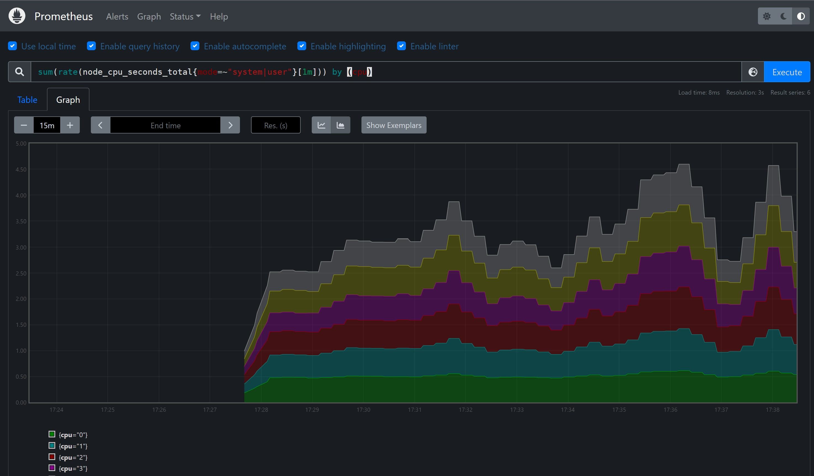

To see the same graph you should click to `Show stacked graph` state button.

Here you see CPU usage by individual cores, to see the whole CPU utilization remove `by (cpu)` at the end of the expression. The `[1m]` part of the expression means that the CPU usage is aggregated by 1 minute. You can use [other](https://prometheus.io/docs/prometheus/latest/querying/basics/#time-durations) intervals.

The next one is a disk free space or disk usage. Node Exporter do not expose disk usage, but instead it expose the whole disk size and available bytes. We can combine them to get what we want. Type the following expression:

```text
(node_filesystem_size_bytes - node_filesystem_avail_bytes)/node_filesystem_size_bytes
```

In my case, I see the following:

```text
{device="/dev/mmcblk0p1", fstype="ext4", instance="192.168.3.76:9100", job="3.76", mountpoint="/"}
0.9683696202749889
{device="/dev/sda1", fstype="ext4", instance="192.168.3.76:9100", job="3.76", mountpoint="/home/data"}
0.9142943061977846
{device="tmpfs", fstype="tmpfs", instance="192.168.3.76:9100", job="3.76", mountpoint="/run"}
0.005465893342506119
{device="tmpfs", fstype="tmpfs", instance="192.168.3.76:9100", job="3.76", mountpoint="/run/lock"}
0.00078125
{device="tmpfs", fstype="tmpfs", instance="192.168.3.76:9100", job="3.76", mountpoint="/run/user/1001"}
0
```

Very informative! If your service consume a lot of disk space you can use graphs to monitor a disk consumption.

The next popular metrics are memory and swap usage. There are many memory related metrics but the most useful are:

- node_memory_MemTotal_bytes
- node_memory_MemAvailable_bytes
- node_memory_MemFree_bytes

Let's see memory usage:

```text
(node_memory_MemTotal_bytes - node_memory_MemFree_bytes)/node_memory_MemTotal_bytes
```

If we switch to the `Graph` tab we see the picture:

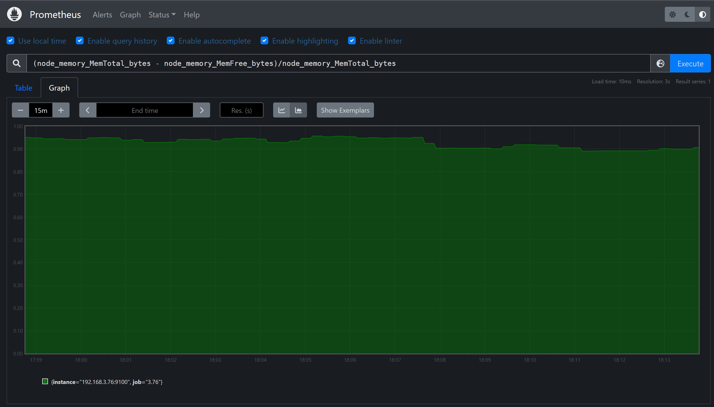

The last portion of metrics is swap usage. It's mostly the same as memory metrics:

- node_memory_SwapTotal_bytes
- node_memory_SwapFree_bytes

Use the expression to see the swap consumption:

```text
(node_memory_SwapTotal_bytes - node_memory_SwapFree_bytes)/node_memory_SwapTotal_bytes
```

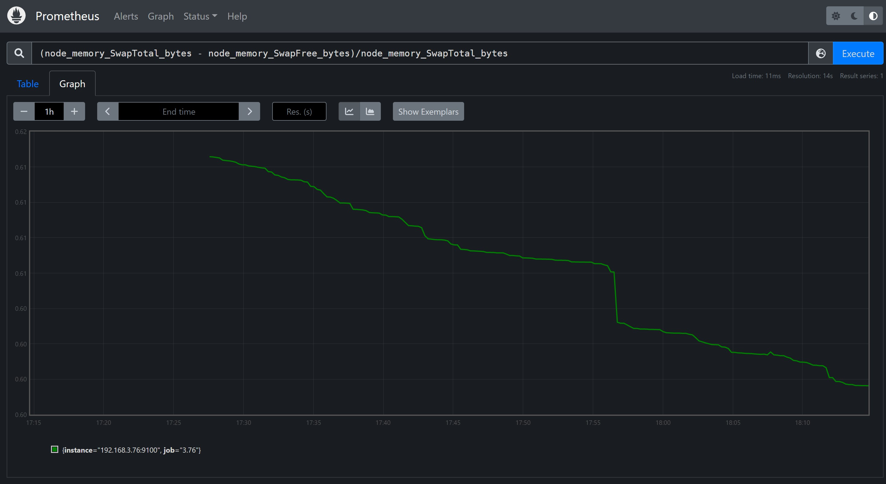
